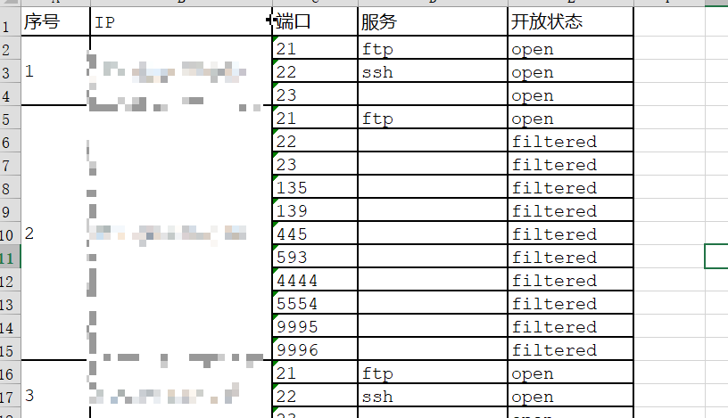

# parser_nmap_xml_2_Excel

## 脚本功能

- 批量解析指定文件夹内的所有`nmap`扫描结果的`xml`文件
- 将解析结果导出为`excel`文件
- 解析内容主要针对存活主机端口，端口开放状态以及端口开放的服务

> 注意1：文件夹中的XML文件必须以`.xml`作为后缀

> 注意2：指定导出文件名尽量以`.xlsx`作为后缀

## 依赖包

__python 2的环境__

```angular2html
pip install xlsxwriter
```

> 使用教程参见[官方文档](https://xlsxwriter.readthedocs.io/format.html)

> 用过那么多python的excel模块，感觉这个相对来说学起来和用起来更加的实惠，公式，格式设置，图标，单元格合并应有尽有。

## 使用方法

```angular2html
[!] Usage: parserXML.py XMLPATH [reportfilename]
[!] Demo: parserXML.py xmldir result.xlsx
```

## 导出Execl展示



